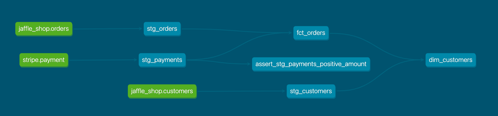

### Description:
A simple test project built using the [dbt Fundamentals](https://courses.getdbt.com/courses/fundamentals) course.

If you're interested in dbt, I'd highly recommend checking out the course linked above - it covers modelling (via SQL files), sources (via Jinja references), testing (via YAML files), documentation (dbt docs generate) and deployment (using dbt Cloud).

A quick summary of my learnings from the course:
- dbt (data build tool) focuses on the **transformation** aspect of the Extract, Load, Transform (ELT) pipeline

- dbt empowers data teams to leverage software engineering principles for transforming data

- You set up the connection to your data warehouse (Snowflake, Redshift, etc.) in a YAML (YAML Ain't Markup Language) file and dbt is able to connect directly to the data

- It allows you to build models using SELECT statements (some knowledge of Common Table Expressions (CTEs) is also useful here) and dbt takes care of the Data Definition Language (DDL) statements to create/replace tables and views in your data warehouse. These can be materialised via the command `dbt run`

- It allows you to run generic tests on your source data and models (unique, not_null, accepted_values and relationships) as well as configure your own tests in YAML files - these can be run using a variation of `dbt test`

- It allows you to define the lineage of your transformations from the source data to your final models via Jinja templating `{{ source('schema', 'table_name') }}` and `{{ ref(name_of_your_model) }}` which encourages modularity of your code. It also has the awesome benefit of being able to produce a Directed Acyclic Graph (DAG) of the transformation pipeline such as the one below, via the commands `dbt docs generate` followed by `dbt docs serve`:

### Jinja, Macros and Packages

A continuation of the fundamentals course, the [Jinja, Macros, Packages](https://courses.getdbt.com/courses/jinja-macros-packages) course dives deeper into the Jinja templating engine and shows how it extends the functionality of dbt via macros and packages.

Jinja is a Python-based templating language and its inclusion in dbt allows you to utilise and embed programming concepts in your SQL models.

Some of the basic syntax includes: 
-  is a statement 
- {{ ... }} is an expression 
- {# ... #} is a comment

Macros are essentially just functions that you can define in the Jinja templating language and are stored in the macros folder in your dbt project as .sql files.

Packages are useful for leveraging code and macros that others in the community have built, so that you don't have to build them from scratch yourself - one example of this is the date_spine macro from the [dbt_utils](https://hub.getdbt.com/dbt-labs/dbt_utils/0.1.7/) package, that allows you to generate a list of configured dates. These are imported by adding them to a `packages.yml` file in the root of your project (same level as your `dbt_project.yml` file) and by running the command `dbt deps` to install the dependencies.
